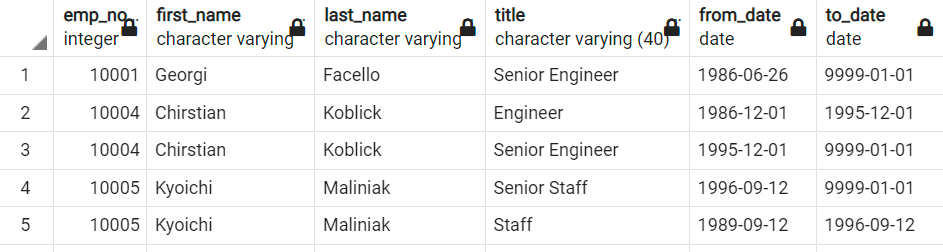
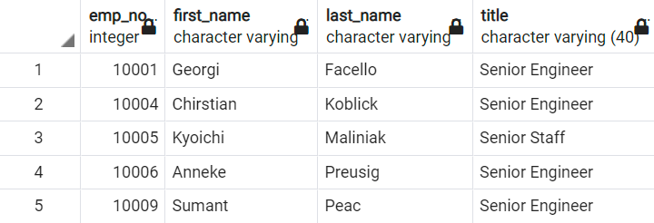
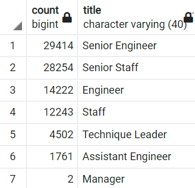
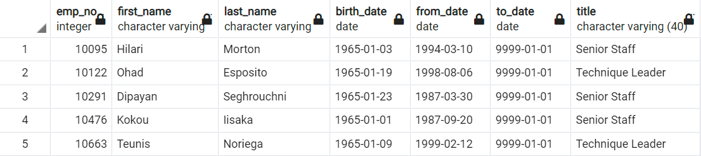

# Hewlett_Packard_Analysis

## Resources
*   Software:
    *   PostgreSQL 14.1
    *   pgAdmin 4
    *   Visual Studio Code 1.63.2
*   Data:
    *   departments.csv
    *   dept_emp.csv
    *   dept_manager.csv
    *   employees.csv
    *   salaries.csv
    *   titles.csv

## Overview/Purpose
The goals of this analysis were to provide/create tables within SQL with data showing...
*   Titles of individuals nearing retirement
*   The number of staff per title
*   Individuals that were eligible for the proposed mentorship program for training new hires

Pewlett Hackard has recognized the impending "Silver Tsunami" of retirees, so I was tasked with providing this data for managers to begin preparations to hire and train replacements of these staff as they retire.

## Results
### Retirement/Unique Titles
The list of employees in retirement age included the information of: Employee Number, First Name, Last Name, Title, Start Date or `from_date`, and End Date or `to_date`. The table itself was built around birth date to show all employees born between 1952 and 1955, the defined "retirement age". Note that birth date is not a column in this table.



As you can see from this screen shot, I was able to get the info. However, there are duplicate entries for employees that have held multiple titles, almost certainly due to internal promotions, so an additional table was needed for unique title per employee.

To get the current titles of all employees I needed to use the `DISTINCT ON` statement within the SQL query to retrieve only the first occurrence of each employee number.



Compared to the first screenshot, we can see that the duplicated rows are not gone and our table is updated to only the current information.

From there I needed to gather the number of retiring employees grouped together by title. This was accomplished by using the newly created unique_titles table and the `GROUP BY` and `ORDER BY` functions to add the titles together and show them in descending order.



This table shows that quite a few members of the Senior Engineer and Senior Staff titles are within the defined "retirement age".

### Mentorship Eligibility

Pewlett Hackard's criteria for who is eligible to be part of the mentorship program was that their birth year be 1965. These seasoned individuals hold a tremendous amount of skill and knowledge from their many years of experience, but are not at the age as to be considered for potential retirement in the immediate future.

Obtaining this list of names was done by using the provided employees dataset and joining it with the Department Employees and Titles datasets, while filtering for current employees, with birth years of 1965. 

```
WHERE (de.to_date = '9999-01-01')
	AND (e.birth_date BETWEEN '1965-01-01' AND '1965-12-31')
ORDER BY e.emp_no;
```
* Note: The date of `9999-01-01` is used as a placeholder for individuals still working for PH.



This screenshot shows that we were able to find a list of potential mentors from our data.

## Summary

The findings from these queries are incredibly important to the continued success of PH as the potential retirees begin leaving the workforce. This research also answers a few questions.
1. How many roles will need to be filled as the "Silver Tsunami" begins to make an impact?
    *   These retirees are likely already beginning to leave the          workforce (oldest possible employees are 70 years old) so **immediate** action is needed to train and replace them. These results show that there could be upwards of 72,000 employees retiring within the next 5 years. The majority of which would be from the Engineering Department. 
2. Are there enough qualified, retirement-ready employees in the departments to mentor the next generation of Pewlett Hackard employees?
    *   Per the `mentorship_eligibility` table created from the provided data, there are only 1549 potential mentors, 670 of which work in the Engineering Department, which will soon have just under 29,000 potential job openings. Even if 100% of the eligible individuals were interested in the Mentorship Program, each mentor would be responsible for training many dozens staff members. Depending on the complexity of the program and training, this may be an enormous ask of the mentors to take on these additional responsibilities.

Additional data might be of use in this situation to avoid the incoming difficulties of this "Silver Tsunami". 
*   First, expansion of mentorship eligibility to include more people initially would likely be very beneficial. Rather than just staff born in 1965, eligibility could be based on tenure. For example, staff that have worked in their position for at least 15 or more years. 
*   Second, reevaluating potential mentors annually, as new employees become old enough for eligibility into the mentorship program, would be a great way to ensure the program continues and expands. An additional querie(s) to collect the employee information of the "soon to be eligible" mentor staff would be important so to begin recruiting them.
